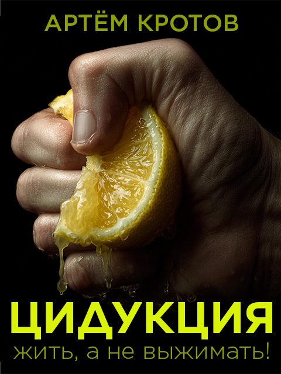

# Книга "Цидукуция. Советы по продуктивности в цифровом мире"

- [Предисловие](foreword.md)
- [Что такое продуктивность?](productivity.md)
- [Что такое видение?](vision.md)
- [Какие препятствия на пути?](thinking-slow-and-fast.md)
- [Как открыться новым навыкам и знаниям?](open-mind.md)
- [Почему важно брать ответственность за свое развитие?](obligation.md)
- [Как перестать беспокоиться?](stop-worrying.md)
- [Список задач: Как ничего не забыть?](to-do-list.md)
- [Эффект Зейгарник: Почему нам нравится выполнять задачи?](effect-zeigarnik.md)
- [Матрица Эйзенхауэра: Как классифицировать задачи?](eisenhower-matrix.md)
- [Пари Паскаля: Как принимать сложные решения?](paskal.md)
- [Поллинг: Как работать с асинхронными зависимостями?](async.md)
- [Календарь: Как работать с расписанием?](calendar.md)
- [Опоздания: Как перестать это делать?](not-late.md)
- [Муда: Какие существуют потери?](muda.md)
- [Хронофаги: Кто пожирает наше время?](chronofags.md)
- [Социальные сети: Как не поддаться FOMO?](social-networks.md)
- [Уведомления и пуши: Как не стать их рабом?](disable-pushes.md)
- [Электронная почта: Как не утонуть в письмах?](email.md)
- [Рабочее место: Как создать идеально пространство?](workspace.md)
- [Фасилитация: Как планировать и проводить эффективные встречи?](facilitation.md)
- [Атомные привычки: Как подружиться со своей обезьяной?](habbits.md)
- [Как оптимизировать процессы?](process.md)
- [Распределяйте ваши часы по ценности для вас](vechernye-chasi.md)
- [Решайте когнитивные задачи во время выполнения рутинных](organy-chuvstv.md)
- [Soft skills: Как развивать "мягкие" навыки?](soft-skills.md)
- [Обучение: Как приобретать новые знания?](learning.md)
- [Программирование: Почему вам стоить попробовать?](programming.md)
- [Автоматизация: Что и как можно автоматизировать?](automation.md)

Скачать в [docx](distr/the-digital-productivity-book.docx) или [fb2](distr/the-digital-productivity-book.fb2).

Эта книга выпускается под лицензией [Creative Commons Attribution 4.0 International License][cc-by].

[![CC BY 4.0][cc-by-image]][cc-by]

[cc-by]: LICENSE
[cc-by-image]: https://i.creativecommons.org/l/by/4.0/88x31.png
